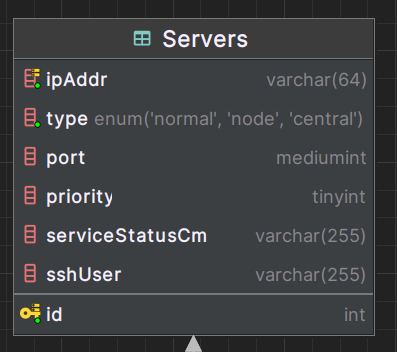

# Database Configuration

Here is the guide to configure the database of the project.
This will be divided into few parts, to make it easier to understand.
> [!NOTE]
> The language used in the database is MySQL, with the ORM [Prisma](https://www.prisma.io/).

## Table of Contents

1. [Presentation](#presentation)
2. [How to initialize the database](#init)
3. [How to add a new server](#server)
4. [How to add a new service](#service)
5. [How to add a new job](#job)

<br><a name="presentation"></a>
## 1. Presentation

The database is composed of few tables _(**21** in total)._
Here's the whole schema of the database:
<br>
We will now go through the main parts of the database.
But first, we need to set up the database

<br><a name="init"></a>
## 2. How to initialize the database

We make use of the ORM [Prisma](https://www.prisma.io/) to manage the database.
No need to worry about its installation, it is already installed in the project. 
Just need to run `npm i` command to install the dependencies.

We now need to create the database (Do not forget to add your database url with credentials in it in the .env file)
To do so, first run thIS command in order to generate the prisma client file:
```bash
npx prisma generate
```

Then, we need to run the following command:
```bash
npx prisma migrate dev --name init
```
This will create the database and the tables.
> [!NOTE]
> This will create all the tables within **schema.prisma** file,
which is in the **prisma** folder. If there is any change in this file, you need to run the command again.

Now, your database is ready to be used.

<br><a name="server"></a>
## 3. How to add a new server

In this watchdog, you can add servers to watch for their state.
<br>To do that, you need to add a new entry to the `Servers` Table :
<br>
<br>Here is the description of the fields:
- **id**: The id of the server. It is automatically generated by the database.
- **ip**: The ip of the server.
- **type**: The type of the server. It is used to determine which type of server it is between Central, Node or Normal.
- **port**: The port of the server.
- **priority**: The priority of the server. It is used to determine which is the central server and which is the backup server.
- **serviceStatusCmd**: The command to get the status of the services of the server.
- **sshUser**: The ssh user of the server.

<u>Here's few examples of servers in database :</u>
<br>Normal server :

| id  | ip | type | port | priority | serviceStatusCmd | sshUser |
| --- | --- | --- | --- | --- | --- | --- |
| 1 | 192.168.10.10 | Normal | null | null | systemctl | root |

<br>Central server :

| id | ip | type | port | priority | serviceStatusCmd | sshUser |
| --- | --- | --- | --- | --- | --- | --- |
| 2 | 192.168.10.11 | Central | 3000 | 1 | null | null |

<br>Node server :

| id | ip | type | port | priority | serviceStatusCmd | sshUser |
| --- | --- | --- | --- | --- | --- | --- |
| 3 | 192.168.10.12 | Node | null | null | null | null |

> [!NOTE]
> The priority field is used to determine which is the central server and which is the backup server (1 or 2).
> The port indicates the port of the socketIO server for central server.
> The serviceStatusCmd is the command to get the status of the services of the server and the sshUser is the ssh user of the server.
These commands are only used for normal servers.

<br><a name="service"></a>
## 4. How to add a new service

> [!NOTE]
> In this case, please note that we'll focus on services of type 0, which are the "services" related to the servers.

To add services that the main server will watch, you first need to create the service category in `services` table :
<br>
<br>Here is the description of the fields:
- **id**: The id of the service. It is automatically generated by the database.
- **name**: The name of the service.
- **port**: The port of the service. It is used to identify the service, but not used in the program.
- **type**: The type of the service. It is used to identify the service : 0 for a service that is not a group of data, 
connected to a server, 1 for a service that is a group of data.
- **url**: The url to grab data from for services of type 1. If data object that we'll see later has not any url filled,
the program will use the link filled in the service to grab its value or information.

<u>Example:</u>
| id  | name | port | type | url |
| --- | --- | --- | --- | --- |
| 1 | mysql | 3306 | 0 | null |

<br>Then, you need to add the service to the server in the `servicesOfServers` table :
<br>
<br>Here is the description of the fields:
- **serviceId**: The id of the service. It is used to identify the service.
- **serverId**: The id of the server. It is used to identify the server.
- **jobId**: The id of the job we want to assign the service. It could be null if we do not want to assign the service to a job.

<u>Example:</u>

| serviceId  | serverId | jobId |
| --- | --- | --- |
| 1 | 1 | null |

<br><a name="job"></a>
## 5. How to add a new job

To add a new job, you need to add a new entry to the `jobs` table :
<br>
<br>Here is the description of the fields:
- **id**: The id of the job. It is automatically generated by the database.
- **name**: The name of the job.
- **interval**: The interval of the job (in ms). It is used to determine how often the job will be executed *(Not used yet)*

<u>Example:</u>

| id  | name | interval |
| --- |  | --- |
| 1 | mysql | 10000 |

<br>Then, you need to add the job to the server in the `serversOfJobs` table to define which job is assigned to which server :
<br>
<br>Here is the description of the fields:
- **jobId**: The id of the job. It is used to identify the job.
- **serverId**: The id of the server. It is used to identify the server.

<u>Example:</u>

| jobId  | serverId |
| --- | --- |
| 1 | 1 |